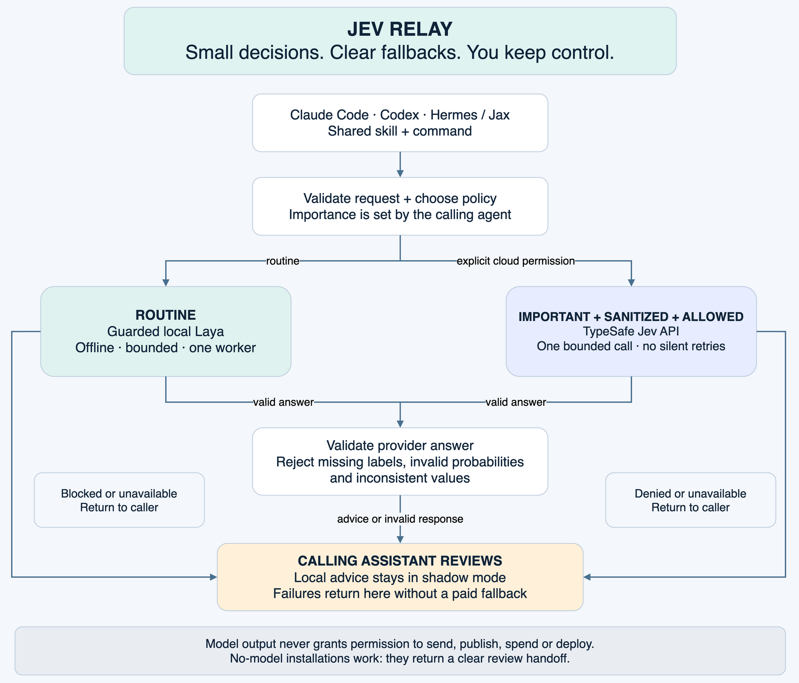

# Jev Relay

**Small decisions. Clear fallbacks. You keep control.**

A local-first advisory router for Claude Code, Codex and Hermes/Jax. Routine choices use a configured local model. Important sanitized checks can use TypeSafe Jev. Unavailable providers and invalid answers return responsibility to the calling assistant, with no silent paid fallback.

This is an early experimental release. It routes **bounded decisions**, not entire coding jobs. Every answer requires review. No claim of Jev-equivalent local accuracy or automatic execution.



## Try it without a key or model

Python 3.10+; the router itself has no third-party dependencies. The optional Laya-MLX environment requires Python 3.11+.

```sh
git clone https://github.com/Dreydrey9000/jev-relay.git
cd jev-relay
python3 -m jev_relay.cli --input examples/route.json
python3 -m unittest discover -s tests -v
```

Without local configuration, the first command returns `status: review`, `provider: frontier`, reason `local_disabled`. **Frontier is a handoff to your calling assistant, not another API call.** A working fallback is the default, even without keys.

## Install for your assistant

```sh
python3 scripts/install_skill.py --target codex
python3 scripts/install_skill.py --target claude
python3 scripts/install_skill.py --target hermes --hermes-home /path/to/hermes/profile
```

Ensure `~/.local/bin` is on PATH. Start a new assistant session if needed for skill discovery. Installation uses symlinks to this checkout; keep it at a stable path. Existing unrelated skills and launchers are preserved. The same CLI and skill contract is used across assistants. It does not replace their main models, private memory, quota routing, or permission systems.

## Local Laya setup (Apple Silicon)

Use a dedicated environment with [Laya-MLX](https://github.com/mizorewww/laya-mlx). Our evaluation uses MLX 0.32.2 and `aac6fef/laya-mlx` revision `20aed815fc6acde75733882e7ec0e3f28aeb9717`. Install the optional runtime with `python -m pip install -r requirements-laya.lock` in a separate Python 3.12 environment. Download its checkpoint separately into a local directory. Keep model weights out of Git. The English model file is about 843 MB; runtime memory is larger. Published Laya context limits include questions and options.

Create `~/.config/jev-relay/config.json` using absolute paths:

```json
{
  "local_enabled": true,
  "python": "/absolute/path/to/laya-venv/bin/python",
  "model_path": "/absolute/path/to/downloaded/laya-checkpoint",
  "guard_module": "/absolute/path/to/jev-relay/jev_relay/guard.py"
}
```

The built-in guard supports macOS/Linux. The actual Laya-MLX worker needs Apple Silicon. A host can supply a stricter compatible guard; Drey's installation retains his existing guard. The worker is offline and never downloads weights. Long instructions, options, or state are rejected instead of silently truncated. Calls run with a process lock and hard timeout. On Mac they use background task policy and reduced priority. Kill switches, low disk, memory pressure and thermal warnings are respected. The built-in guard cannot inventory every third-party inference runtime; keep other models unloaded and use your host's stricter guard when available.

To disable local inference, create `~/.config/jev-relay/DISABLED`. Drey's existing `~/.codex/local-ai-router/DISABLED` is also honored. Never remove a watchdog kill switch without its owner's explicit approval. `--ack-resource-warning` acknowledges a currently reviewed soft warning only; it cannot bypass hard blocks.

## Important hosted checks

Set `TYPESAFE_API_KEY` through your normal secret manager/environment, or use macOS Keychain service `TYPESAFE_API_KEY` with your current user account. `JEV_API_KEY` is also supported for existing Hermes setups. Never commit or paste a key into a request.

```sh
jev-relay --input examples/route.json --importance important --allow-cloud --sanitized
```

Both flags are required. `--sanitized` is your assertion, **not automatic redaction**. The heuristic secret check is an extra tripwire and cannot guarantee privacy. Hosted requests go only to the fixed TypeSafe endpoint; redirects are rejected and billable calls are not automatically retried.

## Result contract

- `requires_review` is always true. The router never executes actions.
- `status: review` means the calling assistant must evaluate evidence. Local outputs remain in shadow mode even when confident.
- `status: advisory` is an important hosted check, still requiring review.
- `attempts` records provider outcomes without copying input or exception text into logs.
- Normal inference does not persist prompts, answers or credentials. CLI output goes to the calling assistant; that host may retain its conversation.

Supported: text/structured state, choice (2–26 options), score (2–10 levels), and noul (yes probability), up to 32 questions and 32 KiB input. Inputs and provider responses are validated. Unrecognized options, NaN probabilities, wrong question IDs and inconsistent scores fall back to review.

## Evidence and limits

See [test record](docs/testing.md), [synthetic cases](eval/cases.json), and [landscape catalog](docs/landscape.csv) and [ecosystem diagram](docs/open-jev-landscape.png). Unit tests deliberately use mocked providers to prove policy behavior; they are not model-quality evidence. Live model evaluation is reported separately. Never use confidence as permission or a universal accuracy score.

The project is MIT licensed. Model/runtime licenses are separate. It is independent of TypeSafe, Laya and the other upstream projects. No third-party model weights are redistributed.

## For the coaching group

See [ten concrete trial workflows](docs/use-cases.md). Start with public-document relevance or skill shortlisting. Compare proposed choices to reviewed answers before enabling any workflow. Keep arithmetic, money, authorization and execution in code or existing approval flows.

Jev Relay helps entrepreneurs build AI systems instead of hiring an employee by routing bounded decisions while keeping consequential actions under review.

No measured time or cost saving is promised. Improvements depend on task accuracy, cold-start overhead and your hardware.
