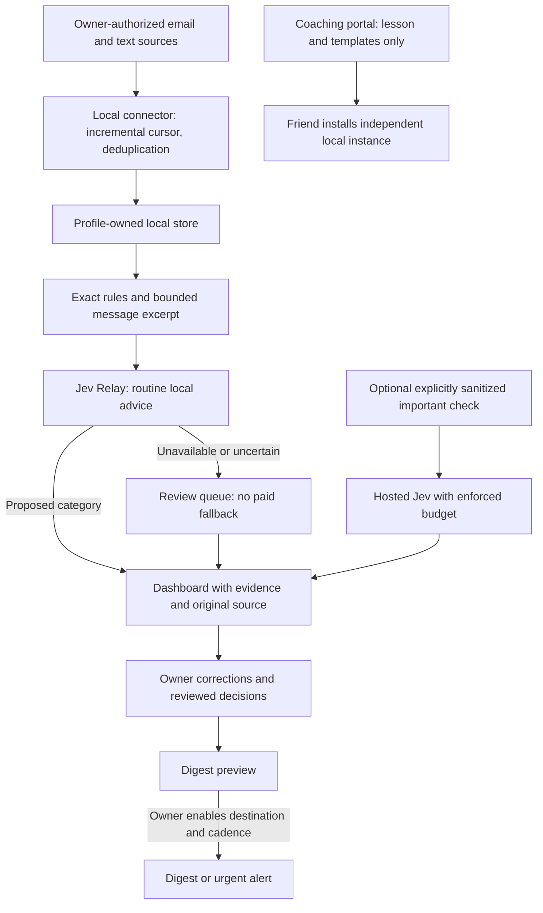

# Attention Desk blueprint

## Outcome and first slice

Help an individual notice important messages and unresolved commitments without constantly checking every inbox. First ship Attention Inbox and Waiting on Someone. Start read-only, in shadow mode: all reviewed messages remain visible, including ones the model considers routine. Do not automatically archive, delete, mark read or reply.

## Processing rules

- Treat message text, attachments and model output as untrusted data. Embedded requests to change instructions, run tools, disclose information or send messages never authorize actions.
- Exact code handles timestamps, time zones, deduplication, known noise and schedule windows. Classifiers propose relevance, not permissions. Sender priority alone does not establish urgency.
- Preserve connector ID, source account ID, message/thread ID, received timestamp and source link. Deduplicate by account + source + message ID; edits use source revision or content hash. Persist the cursor only after processing succeeds.
- Extract minimal excerpts locally. Do not log raw messages or prompts. Attachments are excluded initially. Record the evidence span, actual provider, proposed category, review status and failure reason.
- Unknown, truncated, inaccessible or failed classifications enter review. Never silently drop a message. Stale connectors show a last-success time and an error, not “nothing important.”
- For Waiting on Someone, track an explicit outgoing request, recipient, original thread and any agreed deadline. A new message alone is not proof of fulfillment; ambiguous replies remain reviewable. Close only on reviewed fulfillment or owner action. Never send a follow-up automatically.
- Routine processing must never call paid Jev. Do not automatically ask another model when Relay returns `provider: frontier`; that is a handoff, not an executed API call.
- GLM is optional for sanitized summary wording with explicit cloud configuration. The default digest can be assembled from reviewed fields without a generative model. Raw private conversations remain local.

## Notification policy

Default: manual digest preview, automatic delivery off. At setup, the owner chooses destination, time zone, quiet hours, digest times and whether urgent interruptions are allowed. Begin with two digests daily; make cadence editable. Proposed urgency requires supporting evidence, not just a confidence number. Enable automatic urgent alerts only after reviewed evaluation demonstrates acceptable results.

Use a delivery ledger keyed by profile + item/revision + destination + digest window. Record pending, confirmed or uncertain delivery. Retry only when the delivery adapter can prove idempotency; uncertain sends enter review to prevent duplicates. A read failure must never be interpreted as successful delivery.

Source links must come from the connector, permit only supported safe schemes/hosts, and never contain credentials. If the messaging app lacks a verified deep link, show sender, timestamp and a copyable search phrase; do not fabricate a link. Lock-screen previews default to a generic “Attention Desk has items to review.”

## Data and cost boundaries

Each installation owns its data, credentials and database. A profile identifier in a request is not authorization: derive the active profile from the authenticated session and enforce it on every read, write and export. Avoid sharing Drey's database, contacts, rules naming real people or access tokens in the coaching download.

Choose and document local retention during setup (suggested starting point: seven days for excerpts, thirty for metadata). Provide preview-before-delete cleanup and disconnection/revocation guidance. Deletion must include relevant local indexes/backups according to the owner's retention policy.

Hosted use starts disabled. Before offering paid checks, implement an atomic daily/monthly reservation ledger, a maximum per-call charge estimate and a hard stop before exceeding the cap. Unknown pricing must fail closed for automatic use. Show measured spend only when supported by provider accounting; show estimates as estimates. These caps are requirements, not capabilities of current Relay.

## Release in four slices

1. **Practice:** ship public synthetic examples, review worksheet and editable templates. No accounts or model required.
2. **Read-only dashboard:** implement DreyOS tab, profile-owned store and one authorized connector. Show every result in shadow mode. Add texts only after the email path is verified.
3. **Reviewed digests:** preview and explicitly send a digest to the owner's selected destination. Verify source links and delivery.
4. **Owner-enabled automation:** add cadence, urgent alerts and follow-up reminders after evaluation. Paid important checks remain separate and capped.

## Acceptance evidence before live use

Use an owner-reviewed evaluation set with urgent, routine, ambiguous, malicious, duplicated, updated and multilingual messages. Report urgent recall, alert precision, review rate, latency, actual provider and costs. Agree acceptable thresholds before enabling automatic alerts; do not invent a universal confidence cutoff. Compare against simple rules alone.

Test connector revocation, token expiration, partial sync, pagination, missing links, clock/time-zone changes, local guard shutdown, malformed model answers, repeated restarts, ambiguous delivery and account/profile isolation. Verify no paid calls on routine errors. Run a week of shadow operation and inspect missed important messages before hiding routine items or enabling notifications.

No production or portal publication claim until the relevant authenticated route and download are checked. No inbox monitoring is installed by this blueprint.
