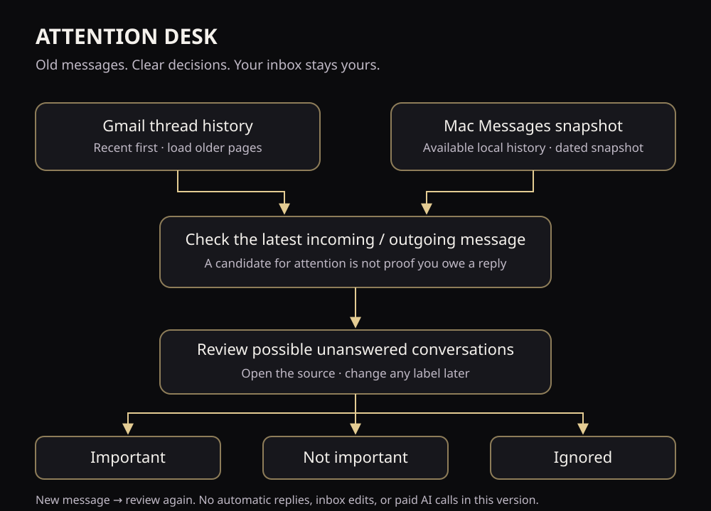

# Attention Desk

**Your messages, reduced to the decisions that need you.** A Jev Relay blueprint for DreyOS and an independently reusable coaching exercise.

Status: working dashboard starter plus blueprint and offline exercises. The DreyOS owner installation now reads Gmail thread history and imported Mac text snapshots, with persistent Important / Not important / Ignored labels. The public [dashboard demo](dashboard/README.md) uses synthetic data and cannot access your accounts. No background monitoring, notifications or AI classification is enabled. Local model quality remains unverified. No paid AI account is required for practice; no savings or accuracy is promised.

## Choose your learning format

| Format | Resource |
| --- | --- |
| Visual | [Rendered workflow diagram](../../docs/diagrams/attention-desk.svg) · [editable source](../../docs/diagrams/attention-desk.mmd) |
| Aural | [Narrated walkthrough](dashboard/engine/public/attention-walkthrough.mp3) · [exact transcript](walkthrough-transcript.txt) |
| Read / write | This setup guide, [blueprint](BLUEPRINT.md), [coaching worksheet](COACHING.md) |
| Kinesthetic | [Run the interactive dashboard](dashboard/README.md), then try the JSON exercises below |



## Start here

1. Read [the blueprint](BLUEPRINT.md) and [DreyOS dashboard contract](DREYOS.md).
2. Copy `templates.json`; change the labels and rules to fit your work.
3. Run the synthetic exercise from the repository root using Python 3.10+:

```sh
python3 blueprints/attention-desk/practice.py --output /tmp/attention-desk-practice
python3 -m jev_relay.cli --input /tmp/attention-desk-practice/inbox-request.json --config blueprints/attention-desk/offline.json
```

The first command writes two validated Relay requests and a practice worksheet. It makes no network requests and runs no model. The second explicitly disables local inference and returns a review handoff, with no paid fallback. Read the worksheet and make your own decisions; do not mistake request validation for model evaluation. Once you have a verified model and passing resource safeguards, omit `--config blueprints/attention-desk/offline.json` to try your own Relay configuration.

4. Use [the coaching lesson](COACHING.md) to teach the exercise. The portal receives this lesson and the template files, never a copy of your personal DreyOS database.
5. Before real inbox use, implement and verify the connector, profile isolation, source links, evaluation and delivery gates in the blueprint.

Files are MIT licensed under the repository license. Model licenses and hardware requirements are separate. There are no bundled credentials, model weights, private messages or subscriptions.

## What is reusable today

- Eight editable workflow definitions; the first two have synthetic practice inputs.
- A working generator that validates the two requests against Relay's own schema.
- A dashboard starter with persistent labels for its running synthetic session, architecture diagram, audio, rollout checklist and teaching script.
- A manual scoring worksheet. Model classification and notification delivery are still implementation work. Live account connections require an owner-authenticated host; never expose the synthetic demo as a production inbox.
